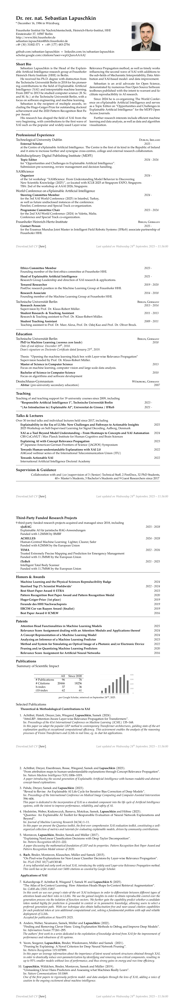

## Concise and Latex-based CV

Building the CV as pdf: Simply call the provided `build.sh`, which almost silently compiles the `tex` source files to `pdf` and cleans up any temporary files (note that failures are also silent):

```
#creates cv.pdf
echo "building cv.pdf"
pdflatex cv &> /dev/null

#creates cv-short.pdf
echo "building cv-short.pdf"
pdflatex -jobname cv-short "\def\shortcv{1} \input{cv.tex}"  &> /dev/null


# generates png previews of long and short CV
echo "generating png preview from cv.pdf"
convert -density 200 -append cv.pdf -quality 85 -alpha remove -alpha off preview/cv.png   &> /dev/null

echo "generating png preview from cv-short.pdf"
convert -density 200 -append cv-short.pdf -quality 85 -alpha remove -alpha off preview/cv-short.png   &> /dev/null


echo "file sizes"
du -sh cv*.pdf
du -sh preview/cv*.png

echo "removing temporary files"
#removes left-over temporary build files
bash clean.sh &> /dev/null
```

Credit for the original CV layout goes to [https://github.com/cies/resume](https://github.com/cies/resume)

Click here to download the long [cv.pdf](cv.pdf), the abridged [cv-short.pdf](cv-short.pdf) or have a look at a (short cv) preview image below.

---

### Short CV Preview (PNG)




